# 🧠 Ai Brain — Master Knowledge Hub (MOC)

> **The Single Source of Truth (SSOT)** for RankRay Agency, the Autonomous Agent Fleet, Client Strategies, and System Operations.

---

## 🗺️ Master Navigation Map

```mermaid
graph TD
    Brain["🧠 Ai Brain (Master Hub)"]
    
    Brain --> Agents["🤖 Agent Fleet"]
    Brain --> Websites["🌐 Client Websites"]
    Brain --> Projects["💻 Projects & Apps"]
    Brain --> Skills["⚡ Skills Library"]
    Brain --> Reports["📊 Reports & Dossiers"]
    Brain --> Rules["📜 Operating Rules"]
    Brain --> Memory["🧠 Fleet Memory"]
    Brain --> Prompts["🎯 Prompts Hub"]
    
    Agents --> Hermes["[[agents/hermes/MEMORY|Hermes (Chief)]]"]
    Agents --> Alpha["[[agents/alpha/MEMORY|Alpha (Stealth)]]"]
    Agents --> Chronos["[[agents/chronos/MEMORY|Chronos (Scheduler)]]"]
    Agents --> Enigma["[[agents/enigma/MEMORY|Enigma (SEO Content)]]"]
    Agents --> Emilia["[[agents/emilia/MEMORY|Emilia (Outreach)]]"]
    Agents --> Scout["[[agents/scout/MEMORY|Scout (SERP Intel)]]"]
    Agents --> Nemo["[[agents/nemo/MEMORY|Nemo (Monitor)]]"]

    Websites --> RankRay["[[websites/rankray.com/index|rankray.com]]"]
    Websites --> Tonic["[[websites/tonicphysio.com/index|tonicphysio.com]]"]
    Websites --> Coinsfera["[[websites/coinsfera.com/index|coinsfera.com]]"]
    Websites --> TeamMoto["[[websites/teammotorcycle.com/index|teammotorcycle.com]]"]
    Websites --> BacklinkCrypto["[[websites/backlinkcrypto.com/index|backlinkcrypto.com]]"]
    Websites --> JustCCell["[[websites/justccell.com/index|justccell.com]]"]
    
    Projects --> RankRayHQ["[[projects/rankray-hq/README|RankRay HQ SaaS]]"]
    Projects --> LegendaryBot["[[projects/legendary-bot/README|Legendary Bot]]"]
    Projects --> Plugins["[[projects/rankray-plugins/README|RankRay Plugins]]"]
```

---

## 🏛️ Core Knowledge Domains

### 1. 🤖 Multi-Agent Fleet
- **Master Orchestration:** [[agents/FLEET-ORCHESTRATION|Agent Fleet Orchestration & Roles]]
- **Agent Profiles & Memory:**
  - [[agents/hermes/MEMORY|Hermes]] — Chief of Staff, Discord & WhatsApp Gateway, Strategist
  - [[agents/alpha/MEMORY|Alpha]] — Tactical execution, isolated channel (`#claw-alpha`)
  - [[agents/chronos/MEMORY|Chronos]] — Time-based audits, background schedules (`#claw-chronos`)
  - [[agents/enigma/MEMORY|Enigma]] — Semantic SEO content architect & cluster designer (`#claw-enigma`)
  - [[agents/emilia/MEMORY|Emilia]] — B2B cold email outreach & lead conversion (`#claw-emilea`)
  - [[agents/scout/MEMORY|Scout]] — SERP competitor forensics & intent research (`#claw-scout`)
  - [[agents/nemo/MEMORY|Nemo]] — Observability, system health & monitoring (`#claw-nemo`)

---

### 2. 🌐 Client Websites & Portfolio
- **Master Directory:** [[websites/index|Websites Portfolio Directory]]
- **Live Assets & SEO Strategies:**
  - [[websites/rankray.com/index|RankRay]] — Technical SEO & Link Building Agency (`rankray.com`)
  - [[websites/tonicphysio.com/index|Tonic Physio]] — Multi-Disciplinary Healthcare Clinic (`tonicphysio.com`)
  - [[websites/coinsfera.com/index|Coinsfera Dubai]] — OTC Cryptocurrency Exchange (`coinsfera.com`)
  - [[websites/teammotorcycle.com/index|Team Motorcycle]] — E-Commerce Powersports Apparel (`teammotorcycle.com`)
  - [[websites/backlinkcrypto.com/index|Backlink Crypto]] — Crypto Backlink & PR Portal (`backlinkcrypto.com`)
  - [[websites/justccell.com/index|JustCCell]] — Technology & Battery Hardware (`justccell.com`)
  - [[websites/sellbitcoinindubai.com/index|Sell Bitcoin In Dubai]] — Crypto Landing Network
- **Cross-Site Audit Rotation:** [[mastersheet|Master Cross-Site Audit Rotation Sheet]]

---

### 3. 💻 Internal Projects & SaaS Engineering
- **Projects Registry:** [[projects/index|Internal Projects Registry]]
- **Application Dossiers:**
  - [[projects/rankray-hq/README|RankRay HQ]] — Internal Agency Management SaaS (CRM, Finance, HRM, SEO)
  - [[projects/legendary-bot/README|Legendary Bot]] — Trading & Strategy Backtesting Lab
  - [[projects/rankray-plugins/README|RankRay Plugins]] — Custom WordPress SEO Extensions

---

### 4. ⚡ RankRay Modular Skills Clusters
- **Skills Catalog:** [[skills/_CATALOG_MAP|Skills Master Catalog Map]]
- **Content & Copywriting:**
  - [[skills/rankray-seo-content-writing/SKILL|SEO Content Writing]] · [[skills/rankray-cold-email-outreach/SKILL|Cold Email Outreach]] · [[skills/rankray-cro-copywriting/SKILL|CRO Copywriting]] · [[skills/rankray-social-distribution/SKILL|Social Distribution]]
- **Technical SEO & Forensics:**
  - [[skills/rankray-technical-seo-audit/SKILL|Technical SEO Audit]] · [[skills/rankray-gsc-forensics/SKILL|GSC Forensics]] · [[skills/rankray-programmatic-local-seo/SKILL|Programmatic Local SEO]] · [[skills/rankray-schema-jsonld/SKILL|Schema JSON-LD]]
- **Engineering & Tech Stacks:**
  - [[skills/rankray-wordpress-engineering/SKILL|WordPress Engineering]] · [[skills/rankray-react-nextjs-engineering/SKILL|React & Next.js]] · [[skills/rankray-backend-api-engineering/SKILL|Backend & Databases]] · [[skills/rankray-cloud-hostinger-ops/SKILL|Hostinger Cloud Ops]]
- **Autonomous Growth Swarms:**
  - [[skills/rankray-crewai-swarms/SKILL|CrewAI Swarms]] · [[skills/rankray-competitor-intelligence/SKILL|Competitor Intelligence]]

---

### 5. 📊 Strategic Reports & Swarm Dossiers
- **Reports Hub:** [[reports/INDEX|Generated Reports & Dossiers Hub]]
- **Recent Swarm Runs:**
  - [[reports/growth-swarm-report-2026-08-28_19-39-44|Autonomous Agency Growth Swarm Report (RankRay)]]
  - [[reports/lead_pipeline_cleanup_2026-06-13|Lead Pipeline Cleanup & Audit]]

---

### 6. 📜 Agency Operating Rules & Standards
- **Rules Hub:** [[rules/INDEX|Agency Operating Rules Hub]]
- **Standards:**
  - [[rules/content/content-rules|Agency Content Quality Rules]]
  - [[rules/content/semantic-seo-writer|Semantic SEO Writer Standards]]
  - [[rules/rankray-location-pages|Location Pages Architecture]]
  - [[rules/file-artifact-mandate|File Artifact Creation Mandate]]
  - [[rules/rate-limiting|API Rate Limiting & Fallback Rules]]

---

### 7. 🧠 Fleet Memory & Daily Journals
- **Memory Hub:** [[memory/INDEX|Chronological Fleet Memory Hub]]
- **Key Records:**
  - [[memory/2026-05-24|System Architecture Initialization]]
  - [[memory/2026-06-04|RankRay HQ Feature Deployments]]
  - [[memory/2026-08-26|Discord Multiplex Routing & Hermes Setup]]

---

### 8. 🔑 Credentials & Security
- **Credentials Guide:** [[docs/ENV|Credential Mapping (Names & Paths)]]
- **Private Secrets:** `master-env.env` (Gitignored)
