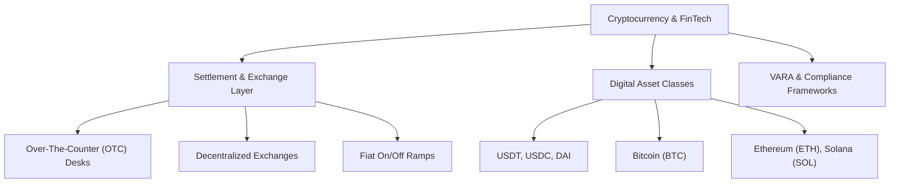

> **Parent Hub:** [[memory/entities/INDEX|🌐 Entity Knowledge Graph Hub]] · [[INDEX|🧠 Master Ai Brain Hub]]

# 🪙 Industry Ontology: Crypto, Web3 & FinTech

> **Semantic schema and entity ontology mapping for cryptocurrency, OTC trading, and blockchain fintech.**

---

## 🗺️ Core Entity Hierarchy

---

## 📌 Standard Entity Triples for Content & Schema
- `USDT` $\rightarrow$ `is pegged to` $\rightarrow$ `United States Dollar (USD)`
- `OTC Desk` $\rightarrow$ `enables` $\rightarrow$ `High-Volume Non-Slippage Trades`
- `VARA` $\rightarrow$ `regulates virtual assets in` $\rightarrow$ `Dubai, UAE`
- `Cold Storage` $\rightarrow$ `protects private keys via` $\rightarrow$ `Air-Gapped Hardware`
