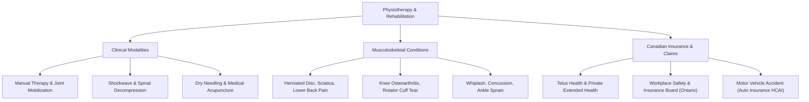

> **Parent Hub:** [[memory/entities/INDEX|🌐 Entity Knowledge Graph Hub]] · [[INDEX|🧠 Master Ai Brain Hub]]

# 🏥 Industry Ontology: Healthcare & Physiotherapy

> **Semantic schema and entity ontology mapping for orthopedic rehabilitation, pain management, and Canadian health insurance.**

---

## 🗺️ Core Entity Hierarchy

---

## 📌 Standard Entity Triples for Content & Schema
- `Physiotherapist` $\rightarrow$ `registered with` $\rightarrow$ `College of Physiotherapists of Ontario`
- `Extracorporeal Shockwave Therapy` $\rightarrow$ `stimulates` $\rightarrow$ `Tissue Neovascularization & Collagen Synthesis`
- `WSIB Claims` $\rightarrow$ `cover` $\rightarrow$ `Workplace Injury Rehabilitation with Zero Out-Of-Pocket Fees`
