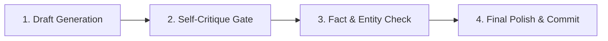

> **Parent Hub:** [[rules/INDEX|📜 Agency Operating Rules Hub]] · [[INDEX|🧠 Master Ai Brain Hub]] · [[agents/FLEET-ORCHESTRATION|🤖 Agent Fleet]]

# 🔄 Agent Self-Reflection & Critique Protocol

> **The mandatory 4-stage quality gatekeeper every agent must execute before declaring any task complete or committing output.**

---

## 🎯 Purpose & Scope

Autonomous agents can suffer from confirmation bias, subtle hallucinations, schema mismatches, or quality drift if they commit output in a single pass. This protocol enforces a **reflective critique loop** across all agents:
- **Enigma:** Content & AEO answers
- **Chronos:** Infrastructure, code, and API calls
- **Emilia:** Outreach copy and prospect qualification
- **Scout:** Research claims and competitor data
- **Nemo:** Architecture, security, and refactoring
- **Hermes:** Task planning and fleet orchestration

---

## 🔍 The 4-Stage Reflection Gate

### Stage 1: Goal & Constraint Alignment
Before finalizing any output, the agent evaluates its own work against the prompt requirements:
- [ ] Did I fulfill 100% of the user's explicit constraints and unspoken context?
- [ ] Did I respect negative constraints (e.g., zero em-dashes, no generic filler, no unencrypted tokens)?
- [ ] Is the output completely actionable without requiring the human to fill in placeholders?

### Stage 2: Fact, Schema & Entity Verification
- [ ] **SEO/Content:** Are all entity triples accurate? Are statistics backed by cited data? Are word counts and header hierarchies strictly met?
- [ ] **Code/Engineering:** Do the endpoints, database fields, and schemas match the active codebase? Are imports valid and typed?
- [ ] **Outreach:** Are prospect names, company domains, and pain points 100% verified against lead sheets?

### Stage 3: Quality & E-E-A-T Defense
- [ ] Does this sound like world-class human expertise or generic AI boilerplate?
- [ ] Are answers formatted as **Answer-First (AEO)** directly beneath headings?
- [ ] Are internal links pointing to valid, active vault notes or live client URLs?

### Stage 4: Error & Hallucination Filter
- [ ] Did I fabricate any URLs, function names, file paths, or statistics?
- [ ] If confidence on any claim is $<95\%$, search or verify against vault SSOT notes before finalizing.

---

## 🛑 Failure & Revision Loop

If any gate fails:
1. Identify the exact failure mode (e.g., *“Thin section in H3 #2”*, *“Missing TypeScript interface”*).
2. Execute targeted self-correction chunk.
3. Re-run Stage 1–4 verification.
4. Only commit when all 4 stages pass with 100% confidence.

---

## 🔗 Related Systems
- [[rules/protocols/multi-agent-consensus|Council of Agents Debate Protocol]]
- [[rules/protocols/agent-self-healing|Self-Healing & Error Recovery]]
- [[rules/content/content-rules|Agency Content Rules]]
- [[skills/rankray-seo-content-writing/SKILL|SEO Content Writing]]
