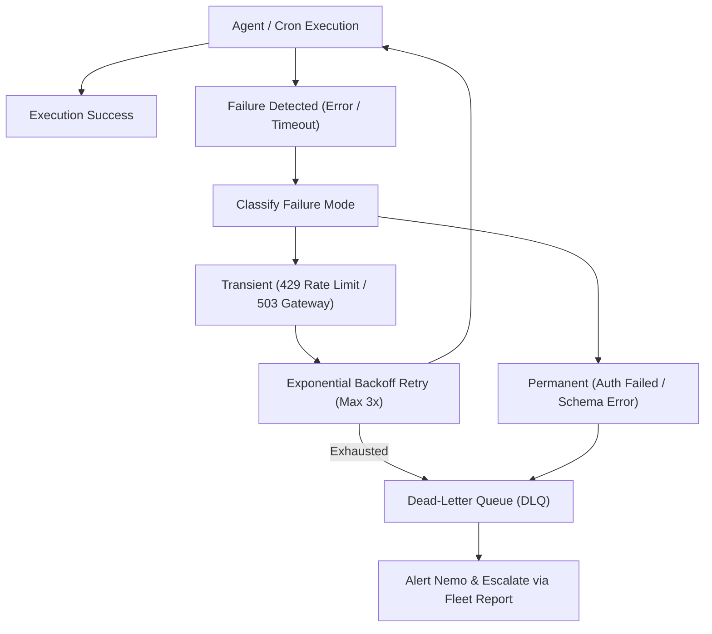

> **Parent Hub:** [[rules/INDEX|📜 Agency Operating Rules Hub]] · [[INDEX|🧠 Master Ai Brain Hub]] · [[agents/FLEET-ORCHESTRATION|🤖 Agent Fleet]]

# 🛡️ Agent Self-Healing & Dead-Letter Queue (DLQ) Protocol

> **Automated resilience engine ensuring background cron jobs, MCP tool calls, and API integrations recover from transient failures without human intervention.**

---

## 🏗️ Architecture Overview

---

## ⚡ 1. Error Classification & Handling Rules

### A. Transient Failures (Auto-Retry)
- **HTTP 429 (Rate Limit):** Pause execution with exponential backoff:
  $$\text{Wait Time} = 2^{\text{attempt}} \times 3\text{ seconds} + \text{jitter}$$
- **HTTP 502 / 503 / 504:** Retry after 10s, 30s, 60s.
- **MCP Timeout:** Re-initialize MCP server session and retry once.

### B. Permanent Failures (Immediate DLQ)
- **HTTP 401 / 403 (Authentication Error):** Do not retry. Immediately flag token expiration in `docs/ENV.md`.
- **JSON Schema Mismatch / Parse Error:** Route payload to Dead-Letter Queue for diagnostic analysis.
- **WordPress REST API Fatal:** Fall back to secondary endpoint or log site incident.

---

## 📥 2. Dead-Letter Queue (DLQ) Management

When a task fails after 3 retries or encounters a fatal error:
1. **Quarantine Payload:** Save the failed task parameters, timestamp, agent ID, and stack trace into `system/reports/misc/` or agent memory.
2. **State Isolation:** Ensure the failure does not block other scheduled queue items.
3. **Escalation Trigger:** Surface the issue in the next **Fleet Status Report** (every 3h) or ping `#claw-nemo`.

---

## 🔄 3. Self-Healing Playbooks

| Component | Failure Symptom | Automatic Self-Healing Action |
|---|---|---|
| **Google Sheets API** | Quota Exceeded (429) | Switch to local JSON cached backup; retry sync in 15 mins |
| **AgentMail** | IMAP Connection Drop | Reconnect socket, verify token in `master-env.env` |
| **WordPress REST** | Application Pass Expired | Fall back to WP cookie auth or flag for user re-auth |
| **Firecrawl Scraper** | Target Cloudflare Block | Switch to fallback HTTP client with rotate headers |

---

## 🔗 Related Systems
- [[rules/rate-limiting|API Rate Limiting Rules]]
- [[rules/protocols/mcp-orchestration|MCP Tool Orchestration]]
- [[agents/FLEET-ORCHESTRATION|Agent Fleet Orchestration]]
