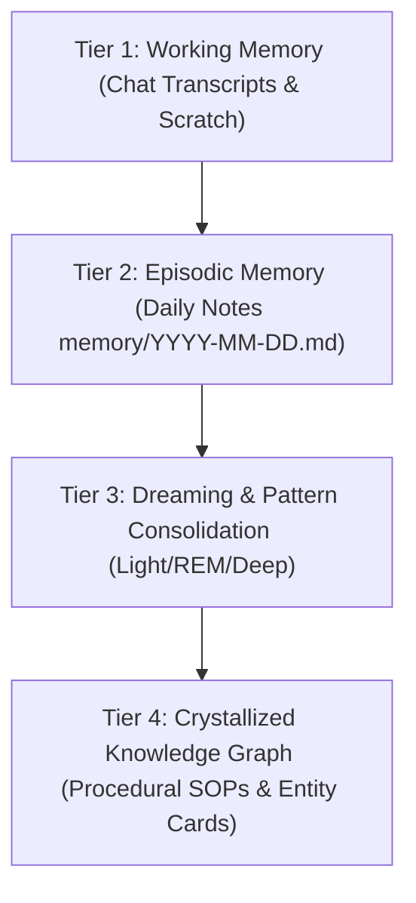

> **Parent Hub:** [[rules/INDEX|📜 Agency Operating Rules Hub]] · [[memory/INDEX|🧠 Fleet Memory Hub]] · [[INDEX|🧠 Master Ai Brain Hub]]

# 🧠 Memory Distillation & Knowledge Crystallization Protocol

> **The architectural pipeline transforming raw daily logs, chat transcripts, and dream logs into permanent, actionable Procedural SOPs and Entity Cards.**

---

## 🏗️ The 4-Tier Memory Hierarchy

---

## 🔄 Distillation Workflow (Weekly Ritual)

Every Sunday during the [[system/WEEKLY_RITUAL|Weekly Ritual]], Chronos and Hermes execute memory distillation:

1. **Episodic Review:** Scan the past 7 days of daily journals (`memory/2026-08-*.md`) and dream summaries.
2. **Signal Extraction:**
   - Did we solve a recurring bug? $\rightarrow$ Extract into [[memory/procedural/INDEX|Procedural SOP]].
   - Did a client update their service offerings, locations, or key staff? $\rightarrow$ Update [[memory/entities/INDEX|Entity Dossier]].
   - Did an agent discover a novel prompt hook or negative constraint? $\rightarrow$ Append to [[rules/content/content-rules|Content Rules]].
3. **Graph Integrity Check:** Verify all new memory nodes are registered in `memory/INDEX.md` with bi-directional links.

---

## 🔗 Related Systems
- [[memory/INDEX|Fleet Memory Hub]]
- [[memory/procedural/INDEX|Procedural Memory Hub]]
- [[memory/entities/INDEX|Entity Knowledge Graph]]
