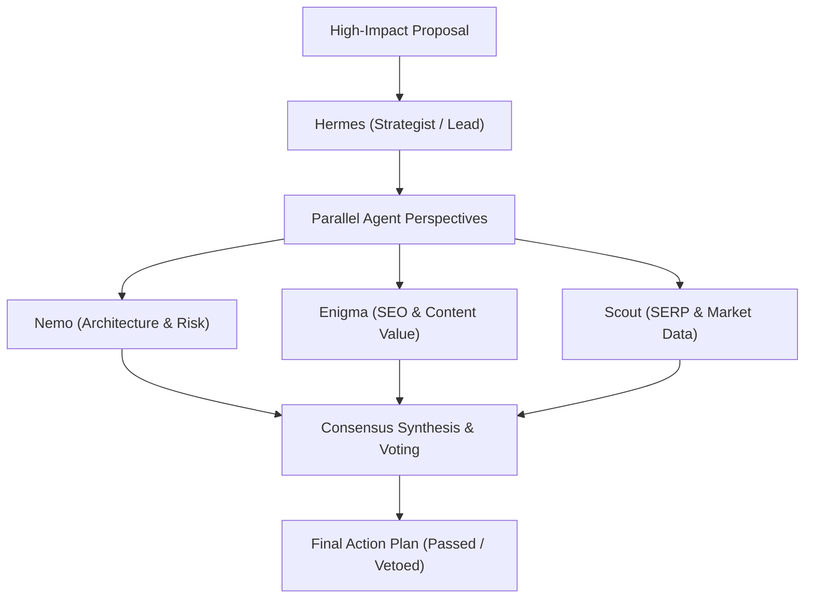

> **Parent Hub:** [[rules/INDEX|📜 Agency Operating Rules Hub]] · [[INDEX|🧠 Master Ai Brain Hub]] · [[agents/FLEET-ORCHESTRATION|🤖 Agent Fleet]]

# ⚖️ Multi-Agent Debate & Consensus Protocol (Council of Agents)

> **Structured decision framework for high-stakes site migrations, core code refactoring, strategy shifts, and fleet resource allocations.**

---

## 🎯 When to Invoke the Council

Single-agent execution is suitable for standard tasks. The **Council of Agents** must be convened when:
1. Re-architecting core client site structures (e.g. deleting/redirecting 20+ URLs on `tonicphysio.com` or `coinsfera.com`).
2. Major database schema migrations or backend rewrites in `projects/rankray-hq`.
3. High-stakes outreach pivots or agency pricing changes.
4. Conflicting directives or unresolvable technical tradeoffs.

---

## 👥 The Voting Council Roster

| Council Member | Specialization & Focus Area | Voting Weight |
|---|---|---|
| **Hermes** | Chief Strategist: Business ROI, Client Scope, Timeline | $35\%$ |
| **Nemo** | System Architect: Security, Stability, Scalability, Code Guard | $25\%$ |
| **Enigma** | SEO Architect: Organic Rankings, Entity Authority, UX | $20\%$ |
| **Scout** | Market Forensics: Competitor Moves, SERP Volatility, Risks | $20\%$ |

---

## 📋 The 3-Step Consensus Workflow

### Step 1: Proposal Submission & Framing
Hermes structures the proposal into standard debate schema:
- **Core Action:** What change is being proposed?
- **Expected Upside:** Traffic gain, conversion increase, or latency reduction.
- **Identified Risks:** Downtime, ranking volatility, indexation cannibalization.

### Step 2: Parallel Critique & Counter-Proposals
Each participating agent generates an independent critique:
- **Nemo:** Reviews edge-cases, rollback feasibility, security attack surface.
- **Enigma:** Reviews semantic impact, cannibalization risk, internal link equity.
- **Scout:** Benchmarks against top 3 market competitors and SERP winners.

### Step 3: Weighted Voting & Resolution Matrix
- **Approval Threshold:** Minimum $\ge 75\%$ weighted approval required to proceed.
- **Veto Power:** Nemo holds absolute veto on unrecoverable data loss or severe security vulnerabilities.
- **Log Decision:** The agreed consensus is recorded in `memory/YYYY-MM-DD.md` before execution starts.

---

## 🔗 Related Systems
- [[rules/protocols/agent-reflection-loop|Agent Reflection Loop]]
- [[rules/protocols/agent-self-healing|Self-Healing & Error Recovery]]
- [[agents/FLEET-ORCHESTRATION|Agent Fleet Orchestration]]
