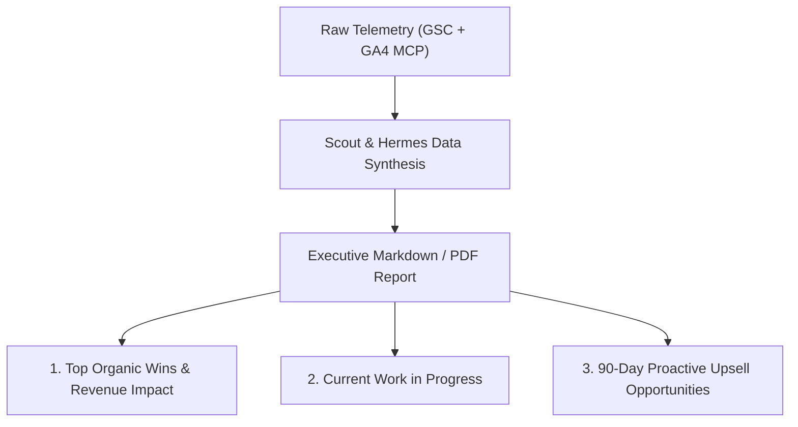

> **Parent Hub:** [[skills/_CATALOG_MAP|⚡ Skills Catalog]] · [[reports/INDEX|📊 Reports Hub]] · [[INDEX|🧠 Master Ai Brain Hub]]

# 📊 RankRay Automated Client ROI & Monthly Insights Engine

> **Standard operating procedure for transforming Google Search Console (GSC) and Google Analytics 4 (GA4) data into executive-grade monthly client reports.**

---

## 🎯 1. Purpose & Client Retention Value

Clients do not care about raw impressions; they care about **qualified traffic, lead conversions, revenue velocity, and clear next steps**. This skill automates the synthesis of monthly deliverables.

---

## 📋 2. Standard Monthly Report Structure

1. **Executive 60-Second Brief:** High-level summary of total organic traffic delta ($+X\%$), top ranking surges, and conversion count.
2. **Top 5 Keyword Surges:** Queries that moved from Page 2 to Page 1 with estimated monthly traffic value.
3. **Content Impact Review:** Performance of newly published articles and refreshed pillar hubs.
4. **Technical Health & CWV Status:** 100% clean crawl report, zero 404 errors, stable Core Web Vitals.
5. **Next Month's Strategic Roadmap:** Clear 3-bullet sprint plan for the upcoming 30 days.

---

## 🔗 Related Systems
- [[reports/INDEX|Reports Hub]]
- [[docs/ga-mcp-reference|GA4 MCP Reference]]
- [[skills/rankray-gsc-forensics/SKILL|GSC Forensics]]
