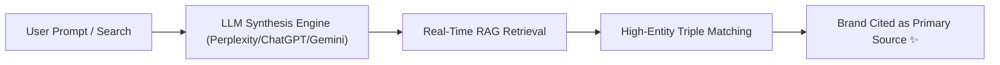

> **Parent Hub:** [[skills/_CATALOG_MAP|⚡ Skills Catalog]] · [[INDEX|🧠 Master Ai Brain Hub]]

# 🚀 RankRay Generative Engine Optimization (GEO) Playbook

> **The 2026 standard for earning primary citations, direct entity mentions, and synthetic answers in Perplexity, ChatGPT Search, Gemini, Claude, and Copilot.**

---

## 🎯 1. Why GEO Differs From Classic SEO

Traditional SEO targets crawler indexing and keyword rank on a 10-blue-link SERP. **GEO** optimizes for LLM synthesis engines that ingest live web data, resolve entity knowledge graphs, and formulate natural-language answers with source attributions.

---

## 🏛️ 2. Core GEO Ranking Factors

### A. High-Density Entity Triples (`Subject-Predicate-Object`)
LLM parsers look for clear factual assertions. Every core service or advice paragraph must contain explicit entity triples:
- *Bad:* *"We offer great back pain services in the local area."*
- *Good:* *"Tonic Physio [Subject] provides evidence-based spinal decompression therapy [Predicate] for patients in Milton, Ontario [Object]."*

### B. Statistical Anchor Assertions
LLMs prioritize pages citing precise percentages, dates, study sample sizes, and empirical data points over vague claims.
- Include data callout boxes: *"According to the 2026 Ontario Physiotherapy Association clinical benchmarks, $78\%$ of acute lumbar strains resolve within 6 weeks of active rehab."*

### C. Direct Quotation Authority & Source Attribution
Provide clear expert author quotes with verified schema credentials (MD, PT, Senior SEO Director) to pass the LLM E-E-A-T extraction threshold.

---

## 📋 3. The 5-Step GEO Article Optimization Framework

1. **Answer Capsule (First 80 words):** Formulate the absolute most concise, factually dense answer immediately under the `<h1>`.
2. **Comparison Matrix:** Include Markdown tables comparing solutions, costs, timelines, or features. LLMs love extracting table rows into conversational answers.
3. **Conversational Question Headers:** Frame `<h2>` tags around natural speech prompts (*"How much does physiotherapy cost in Milton?"*, *"What is the difference between dry needling and acupuncture?"*).
4. **Wikidata / Schema Linking:** Anchor on-page entities to external Wikidata and authoritative ontology URIs via `sameAs` JSON-LD schema.
5. **No AI Fluff Guarantee:** Elimination of generic pleasantries and throat-clearing sentences that cause LLM summary algorithms to truncate or skip the text.

---

## 🔗 Related Systems
- [[skills/rankray-ai-overviews-defense/SKILL|AI Overviews (SGE) Defense]]
- [[skills/rankray-seo-content-writing/SKILL|SEO Content Writing]]
- [[skills/rankray-schema-jsonld/SKILL|Schema JSON-LD]]
