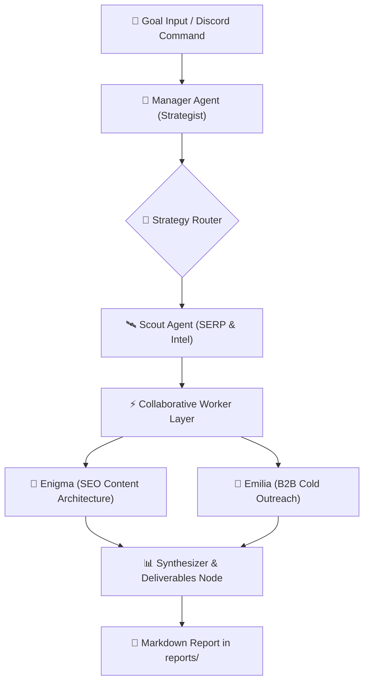

# 🤖 RankRay Autonomous Growth Swarm Mastery

> **The Single Source of Truth for Multi-Agent Orchestration, Strategic Market Intelligence, and Autonomous Execution.**

---

## 🔄 1. Swarm Architecture (CrewAI Flows 1.15+)



---

## 🎯 2. Swarm Execution Tiers

1. **Manager (Strategist):**
   - Synthesizes the master growth blueprint, identifies top 3 high-intent ICP personas, and defines concrete work orders for worker agents.
2. **Scout (Intelligence):**
   - Mines SERP intent gaps, reverse-engineers competitor deliverable flaws (e.g. Audit Theater), and maps target market verticals.
3. **Enigma (SEO Content Architect):**
   - Designs high-conversion pillar guides, spoke landing page clusters, and E-E-A-T entity frameworks.
4. **Emilia (B2B Outreach Specialist):**
   - Crafts a 3-step value-first cold email sequence (Diagnostic Hook + Case Study + Low-Friction Close).
5. **Synthesizer:**
   - Bundles all assets into an executive markdown dossier saved to `reports/growth-swarm-report-[timestamp].md`.

---

## 🚀 3. How to Run the Swarm

### From Terminal:
```bash
"system/agency-flows/run.sh" "Find 5 high-converting SEO audit opportunities for rankray.com and generate cold outreach"
```

### From Discord (`#claw-chat`, `#claw-test`):
- Type your objective directly (e.g. `!swarm Analyze competitor link-building gaps for DTC eCommerce brands`).
- Hermes triggers the flow via its background terminal integration and returns the summarized deliverable.
