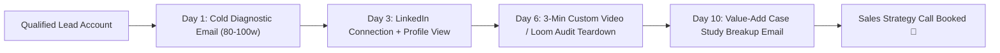

> **Parent Hub:** [[skills/_CATALOG_MAP|⚡ Skills Catalog]] · [[INDEX|🧠 Master Ai Brain Hub]]

# 📈 RankRay Omnichannel B2B Growth Engine

> **Multi-touch pipeline turning cold prospect accounts into high-ticket agency retainers across Email, LinkedIn, and Video Diagnostics.**

---

## 🗺️ The 4-Touch Outbound Cadence

---

## ⚡ 1. Multichannel Touchpoint Playbook

### Touch 1: The Diagnostic Cold Hook (Email)
- **Subject:** quick question about `[Domain]` SEO gap
- **Body:** Pinpoint 1 precise striking distance keyword (#8–18) where they are actively leaking traffic to a direct named competitor.

### Touch 2: Social Touch (LinkedIn)
- Soft connection request without hard sales pitch: *"Hey [First Name], saw your team's expansion in [City]. Enjoyed your recent post on [Topic]—connecting with fellow founders in [Industry]."*

### Touch 3: High-Value Video Teardown
- Record/script a 180-second screenshare highlighting 2 quick wins:
  1. Title tag & H1 mismatch causing CTR cannibalization.
  2. Missing schema preventing rich snippets in local pack.

---

## 🔗 Related Systems
- [[skills/rankray-cold-email-outreach/SKILL|Cold Email Outreach]]
- [[skills/rankray-cro-copywriting/SKILL|CRO Copywriting]]
- [[skills/rankray-social-distribution/SKILL|Social Distribution]]
